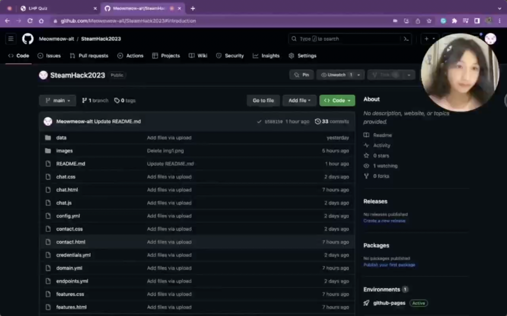

# Quiz and FAQ Chatbot about Le Hong Phong Highschool for the Gifted [](https://meowmeow-alt.github.io/SteamHack2023/index.html)

The Chatbot have not been available on my deployed website so if you want to use it, please follow the instructions below.
---

## **CONTENTS**

- [INTRODUCTION](#introduction)
  
- [INSTALLATION AND RUN RASA](#installation-and-run-rasa)
  
- [MY OWN EXPERIENCE](#my-own-experience)
  
- [VIDEO DEMO WEB](#video-demo-web)

---


---

## **INTRODUCTION** 


The web has 4 pages (languages in use: html, css, javascript):

- "Homepage": Page to introduce the web.
- "Chat with Me": Page contains Chatbot and information about how to use Chatbot.
- "Take Quiz": Page about quizzes, sample questions for users to ask Chatbot.
- "Contact & Feedback": Page that illustrates my topic inspiration and area for user feedback.

You can interact with a friendly and intelligent chatbot that can answer your questions about my school. The Chatbot is powered by artificial intelligence and natural language processing technologies, which enable it to understand your queries and respond accordingly. Whether you are a prospective student, a parent, a teacher, an alumni or a visitor, you will find our chatbot helpful and engaging.

After that, you can visit the "Take Quiz" page on my website to see how many points you can get from the information you have just asked the Chatbot. These questions are also samples for you to ask the Chatbot if you would like.

Please feel free to send me feedback about my website by accessing the "Contact & Feedback" page - the last page on the navigation bar. Your message will be automatically sent to my email. If it is a question, I will give you the answer as quickly as possible. Please be patient and wait for my reply! Thank you so much!

---

## **INSTALLATION AND RUN RASA**

### 1) Installation

My website has no back-end code, so all you have to do is install the "Rasa Chatbot" and activate it.

You can see the tutorial to download it on Rasa Docs if your computer runs on Windows (I use Macbook, so I don't know much about this process on Windows but it is not very hard, please just follow Rasa Docs): [This is the link](https://rasa.com/docs/rasa/installation/installing-rasa-open-source)

But if your computer runs on macOS, the installation process can get more difficult and complicated.
(Just like my Macbook, so besides reading Rasa docs, please follow these steps.)

1. Install homebrew and miniforge for MacOS on this page: 
- [This is the link for homebrew](https://brew.sh/)
- [This is the link for miniforge](https://formulae.brew.sh/cask/miniforge)
2. Open VsCode Terminal, make sure there is no `(base)` before path, for example `(base) jennifertran@MacBook-Air-cua-Tran Hack1`. If there was this `(base)`, run `conda deactivate`
3. Create the environment with conda
```
conda create -n steamhack python=3.10
```
4. Activate the environment
```
conda activate steamhack
```
5. Install Rasa
```
pip install rasa==3.6.2 --no-deps
```
6. Install Rasa dependencies
```
pip install -r requirements.txt
```
7. Install openblas using conda
```
conda install openblas
```
8. Install numpy using conda
```
conda install numpy
```
9. Install scipy using conda
```
conda install scipy
```
10. Install scikit-learn using conda
```
conda install scikit-learn
```
11. Install packaging using conda
```
conda install packaging==21.3
```


### 2) Run Rasa

Open your terminal and use the command below. (Or copy the folder's path and paste it after "cd" as an alternative to "Rasa" phrase.)
```
cd Rasa
```
Make sure your virtual environment was on
```
conda activate steamhack
```
To run the Chatbot on the website, [download my pretrained model](https://drive.google.com/drive/folders/1lyxBtmIWy-R7hcbZd3mjdyU_Xi20-QlA?usp=sharing) and put the file `20230713-231434-cream-puffin.tar.gz` in the folder `Rasa/models`, run this command in terminal
```
rasa run -m models --enable-api --cors "*" --debug
```
Now, the Chatbot should be available on server `http://localhost:5005/webhooks/rest/webhook`

In [`chat.html`](chat.html) file, import the `Chatbot Widget` module present inside [`chat.js`](chat.js) as shown below (My file already had these lines): [This is the link of the creator](https://github.com/JiteshGaikwad/Chatbot-Widget/blob/Widget2.0/docs/instructions.md)

```javascript
<script>
    !(function () {
         let e = document.createElement("script"),
              t = document.head || document.getElementsByTagName("head")[0];
         (e.src = "chat.js"),
              (e.async = !0),
              (e.onload = () => {
                   window.ChatbotWidget.default({
                        rasaServerUrl: "http://localhost:5005/webhooks/rest/webhook", // modify this url 
                        initialPayload: "",
                        metadata: {},
                        botAvatar: "https://cdn-icons-png.flaticon.com/512/8649/8649595.png",
                        widgetColor: "rgb(255, 164, 164)",
                        textColor: "white",
                        userMsgBackgroundColor: "rgb(237, 76, 76)",
                        botTitle: "Your Bot",
                        botSubTitle: "",
                        botMsgBackgroundColor: "#f3eaea",
                        botResponseDelay: "",
                        chatHeaderCss: {
                             textColor: "white",
                             backgroundColor: "rgb(237, 76, 76)",
                             enableBotAvatarBorder: true,
                        },
                        chatHeaderTextColor: "#4c1d95",
                        botMsgColor: "black",
                        embedded: false,
                        buttonsCss: {
                             color: "rgb(255, 164, 164)",
                             backgroundColor: "#e1d7ff",
                             borderColor: "#4b5563",
                             borderWidth: "0px",
                             borderRadius: "999px",
                             hoverBackgroundColor: "white",
                             hoverColor: "#4b5563",
                             hoverborderWidth: "1px",
                             enableHover: false,
                        },
                   });
              }),
              t.insertBefore(e, t.firstChild);
    })();
</script>
```
If you want to train the Chatbot using my data
```
rasa train
```

---

## **MY OWN EXPERIENCE** 

For round 1, I have 11 days (from the day I received the topic to the deadline for submission) to prepare for my project. In the first step, I spent time brainstorming ideas for the project, I chose the direction of developing a Chatbot integrated into the web to interact with users. After that, I limited my ideas to FAQ form, so the data that Chatbot can answer revolves around one main topic, and besides that, only basic, uncomplicated conversations.

In order to allocate time reasonably, I have made work plans to do each day:

- Day 1 and 2: Complete ideas and plans.
- Day 3 and 4: Write the basic framework of the Web using html, css.
- Day 5 and 6: Complete the opening and closing pages of the Web.
- Day 6: Complete the “Take quiz” page.
- Day 7: Download necessary resources to train Chatbot Rasa on Vscode.
- Day 8: Train Chatbot Rasa and integrate it into Web UI.
- Day 9: Test and fix bugs continuously to make sure Chatbot runs fine.
- Day 10: Deploy Web and continue testing.
- Day 11: Record video and submit the work.

One of the biggest challenges I faced in creating my project was installing and integrating the Rasa Chatbot into my website. Because I use a Macbook, I had to download many libraries that are not available or compatible with Apple or Linux systems. Moreover, I had to choose the right versions of the libraries and requirements to avoid errors and conflicts. This took me a lot of time and effort to figure out and fix. However, I am glad that I learned new things and how to overcome challenges because it helped me improve my skills and confidence in coding and problem-solving.

---

## **VIDEO DEMO WEB**

- [LINK VIDEO](https://youtu.be/VZZRiaeZZho)


